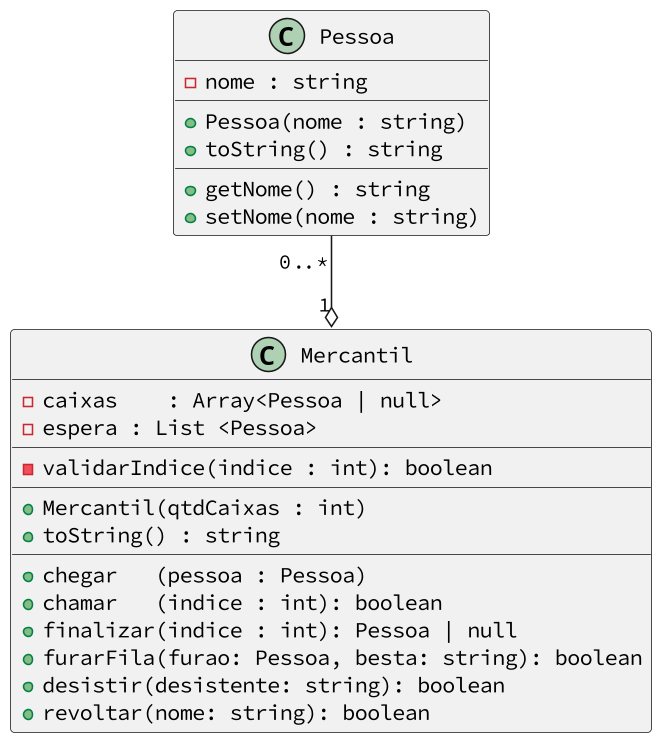

# Bodega

Nosso objetivo é modelar uma fila de atendimento de um Mercantil.

## Funcionalidades

- Quando o mercantil é inicializado, é definida a quantidade de caixas que ele terá para sempre.
- Os caixas são modelados como um vetor de clientes de tamanho fixo. Uma posição do caixa ou terá o valor null para indicar que o caixa está vazio ou terá um objeto cliente.
- A fila de espera é uma lista de clientes de tamanho variável. Todo cliente que chega é inserido no final da fila.
- As operações são entrar, chamarNoCaixa e finalizarAtendimento.

## Diagrama
